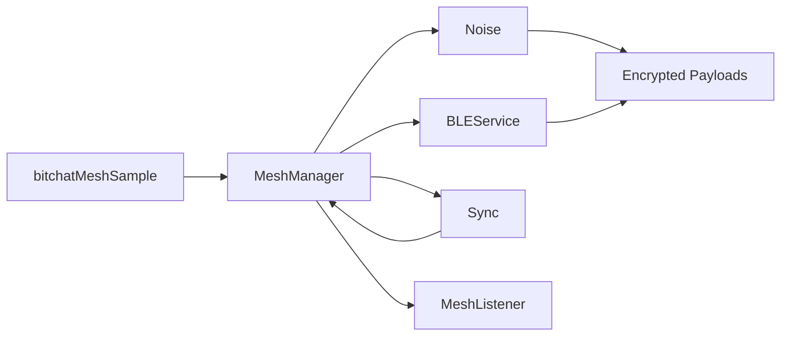

# iOS Mesh Library

This folder contains the standalone iOS mesh library and a SwiftUI sample app.

## Library Overview

The library is packaged as a Swift Package named BitchatMesh. It provides a clean public API through MeshManager and MeshListener, which wrap the BLE mesh engine, Noise protocol, and sync logic. Nostr and Tor integrations are removed so the package focuses strictly on BLE mesh messaging.

Key components:
- MeshManager: public API to start/stop, send broadcast messages, and trigger handshakes.
- MeshListener: callback interface for peer updates, messages, receipts, and Bluetooth state.
- BLEService: BLE scan/advertise/connection engine.
- Noise: handshake and encrypted payload transport.
- Sync: gossip and state reconciliation.
- KeychainManager and MeshConfiguration: configurable keychain service/access group.

## Package Structure

- Package.swift: Swift Package definition for BitchatMesh.
- bitchat-mesh/Sources/BitchatMesh: library sources.
- localPackages/BitLogger: local logging dependency.

## Build The Library

From this folder:

1) Resolve dependencies and build:

    swift build

## Sample App

The SwiftUI sample app is in the bitchatMeshSample folder. It exercises MeshManager and provides a console view and a quick-connect peer list.

### Run In Xcode

1) Open bitchatMeshSample.xcodeproj.
2) Select the bitchatMeshSample scheme.
3) Choose a simulator or device.
4) Run.

### Run From CLI (Simulator)

    xcodebuild -project bitchatMeshSample.xcodeproj \
      -scheme bitchatMeshSample \
      -configuration Debug \
      -sdk iphonesimulator \
      -destination 'platform=iOS Simulator,name=iPhone 16,OS=18.6' \
      build

### Run On Device (Install)

    xcodebuild -project bitchatMeshSample.xcodeproj \
      -scheme bitchatMeshSample \
      -configuration Debug \
      -destination 'platform=iOS,id=YOUR_DEVICE_UDID' \
      -allowProvisioningUpdates \
      install

Note: If you use a Personal Team, set the Team in Xcode under Signing & Capabilities before running on device.

## API Examples

Minimal setup using MeshManager and MeshListener:

```swift
import BitchatMesh

final class DemoListener: MeshListener {
  func onMessageReceived(_ message: BitchatMessage) {
    print("message from \(message.sender): \(message.content)")
  }

  func onPeerListUpdated(_ peers: [PeerID]) {
    print("peers: \(peers.count)")
  }
}

let manager = MeshManager()
let listener = DemoListener()
manager.listener = listener

manager.start(nickname: "ios-sample")
manager.sendBroadcastMessage("hello mesh")
```

## Troubleshooting

- Install fails with missing CFBundleIdentifier or CFBundleExecutable: ensure the sample Info.plist includes `CFBundleIdentifier` and `CFBundleExecutable` (set to build settings).
- CBCentralManager state restoration error: add `bluetooth-central` under `UIBackgroundModes` in the sample Info.plist.
- CBPeripheralManager state restoration error: add `bluetooth-peripheral` under `UIBackgroundModes` in the sample Info.plist.
- Device signing errors: set a valid Team under Signing & Capabilities and rerun with `-allowProvisioningUpdates`.

## Diagram


